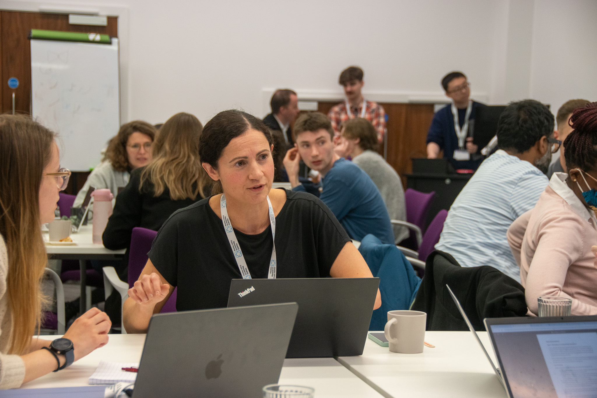
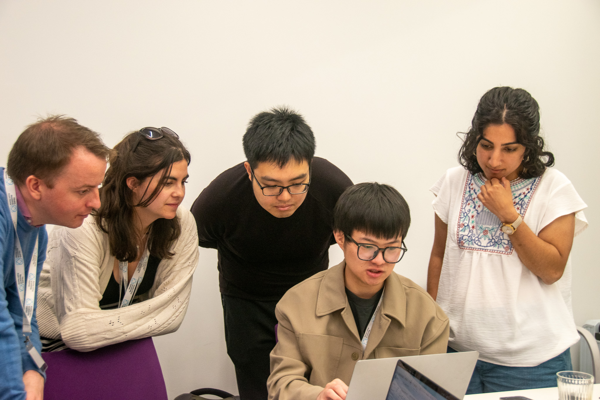
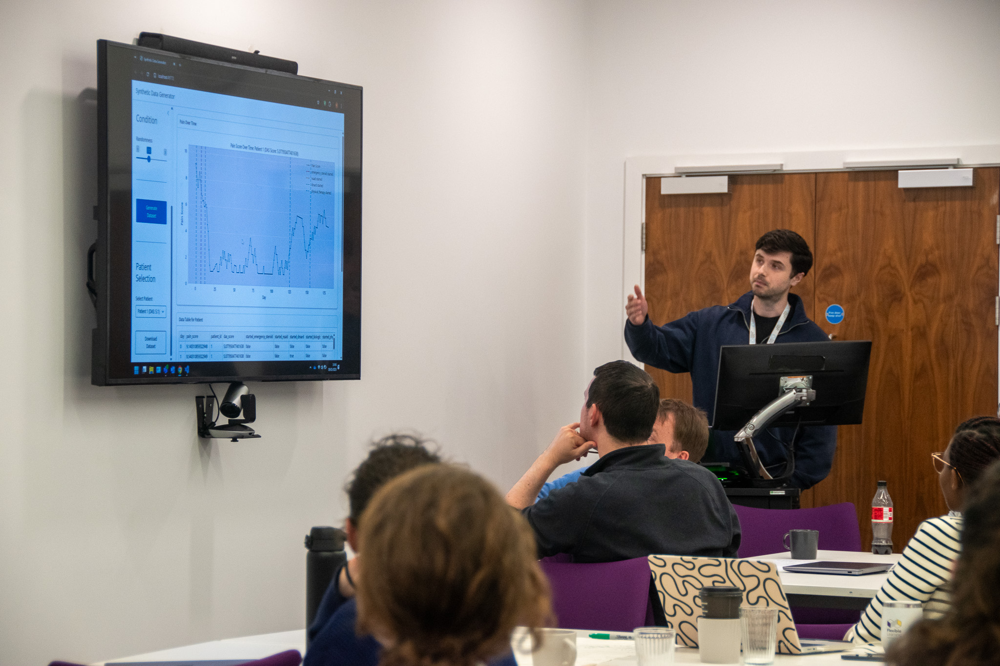
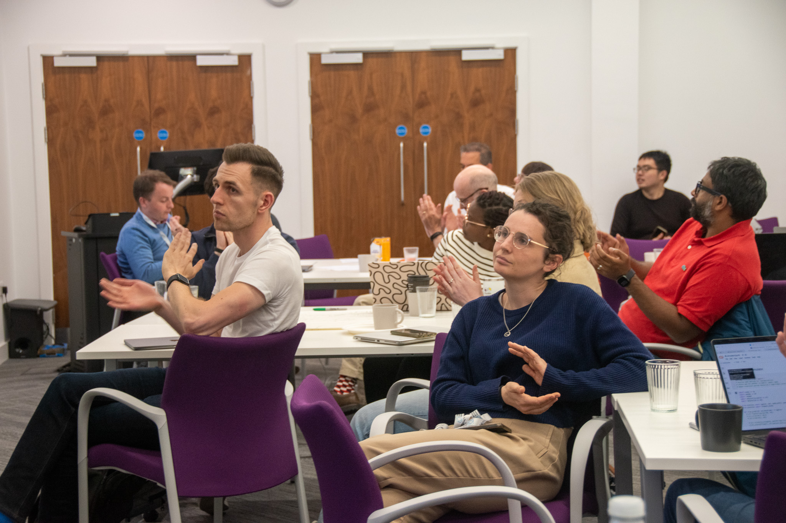

# HRfH Hackathon 2026
## Data Analysis Challenge on Wearable and Smartphone Data with Missingness

This data analysis challenge is being held by Health Research From Home Partnership led by the University of Manchester

|                                               |                                               |
|-----------------------------------------------|-----------------------------------------------|
|  |  |
|  |  |

## Contents

**[About the event](files/about.md)**: Learn about why we set up this event.

**[Event information](files/eventinfo.md)**: Find information about the organisation of the event.

**Pre-Event Preparation**: Information about preparing for this data analysis challenge event.

  - [Problem description](files/problem.md)
  - [Essential skills](files/skills.md)
  - Who should apply:
    - We aim to recruit 20 participants for an in-person session. The participants will include: Early career researchers (such as, PhD students, postdoctoral researchers) from academic or industrial background specializing in health data research.
  - How to get involved:
      - To apply, please [submit your application here](https://forms.cloud.microsoft/Pages/ResponsePage.aspx?id=B8tSwU5hu0qBivA1z6kad88DiHAfwf5OoUGe4ARbVoNURUMwTVZSUENENzZaQTFSVlhPQ1FTODBONC4u). The application deadline is **Sunday 5 April**.
        - Please note, applying does not guarantee you a space. Selected participants will be notified via email in early April, at which point payment details will be provided. **The registration fee is £50** to secure your place. A limited number of bursaries are available as we don’t want finances to be a barrier to attending.
      - If you want to know more, or have any questions please contact us on: [hrfh@manchester.ac.uk](mailto:hrfh@manchester.ac.uk)

## Contact

For any enquiries, please contact the Health Research From Home team [hrfh@manchester.ac.uk](mailto:hrfh@manchester.ac.uk).
