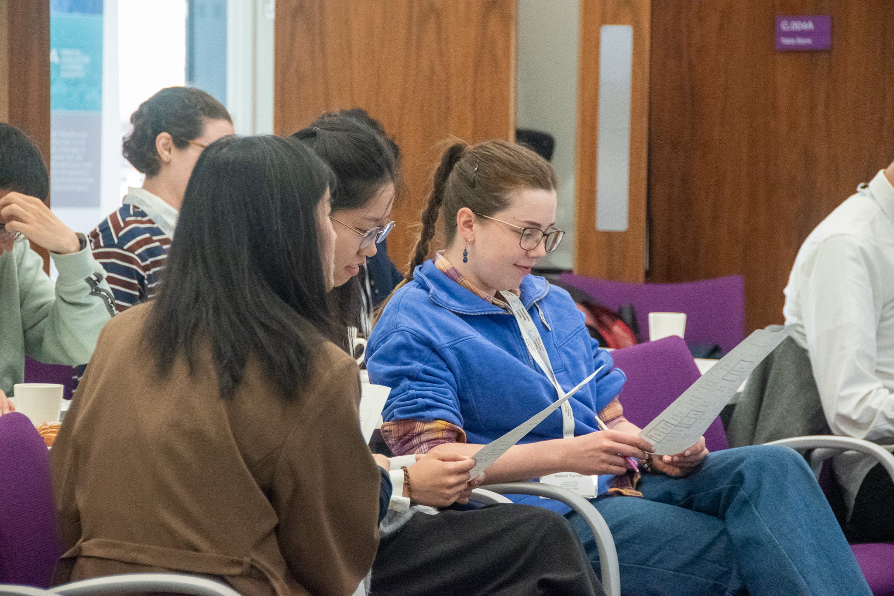
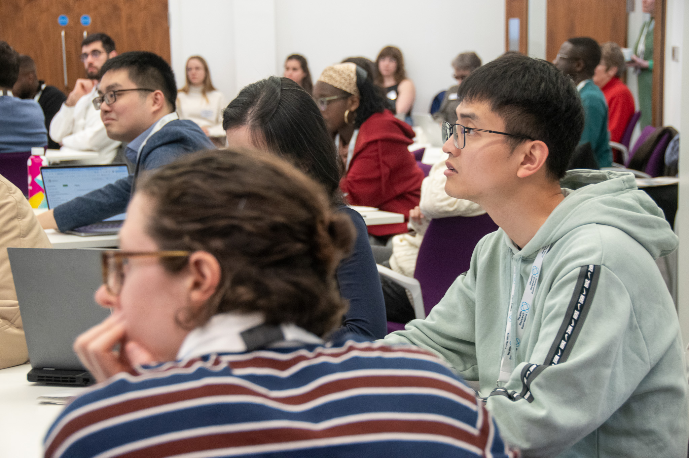
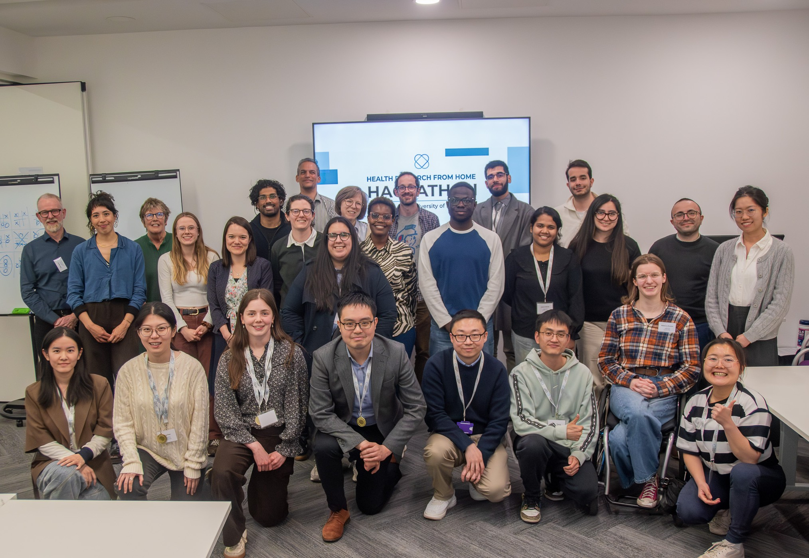
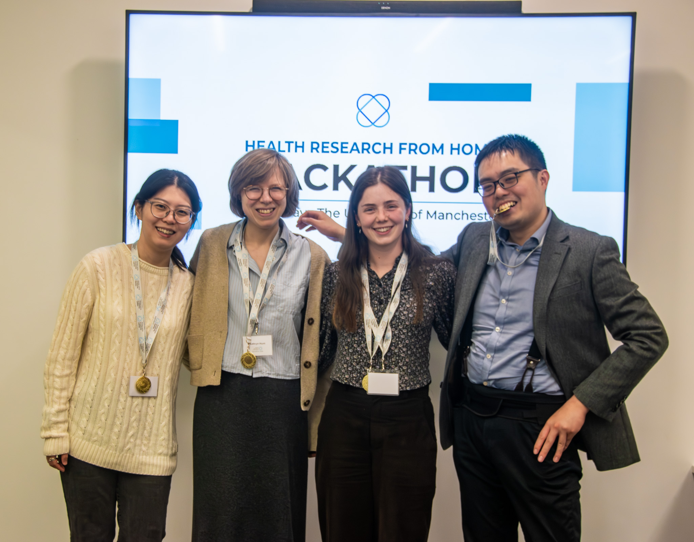

# HRfH Hackathon 2026
### Data Analysis Challenge on Wearable and Smartphone Data with Missingness

This data analysis challenge is being held by Health Research From Home Partnership led by the University of Manchester

|                                               |                                               |
|-----------------------------------------------|-----------------------------------------------|
|  |  |
|  |  |

## Contents

We are delighted to have successfully run the HRfH Hackathon 2026, bringing together participants, speakers, facilitators, PPIE colleagues, and judges for an engaging data analysis challenge on wearable and smartphone data with missingness.

The event materials have now been shared:
- Talks and supporting materials are available in the **[resources](https://github.com/Health-Research-From-Home/HRfH-Hackathon-2026/tree/main/resources)** folder.
- The winning team’s Task 1 and Task 2 code and slides are available in the **[winning-team-work](https://github.com/Health-Research-From-Home/HRfH-Hackathon-2026/tree/main/winning-team-work)** folder.

**[About the event](files/about.md)**: Learn about why we set up this event.

**[Event information](files/eventinfo.md)**: Find information about the organisation of the event.

**Pre-Event Preparation**: Information about preparing for this data analysis challenge event.

  - [Problem description](files/problem.md)
  - [Essential skills](files/skills.md)
  - Who should apply:
    - We aim to recruit 20 participants for an in-person session. The participants will include: Early career researchers (such as, PhD students, postdoctoral researchers) from academic or industrial background specializing in health data research. Applicants should have a basic understanding of R or Python.
  - How to get involved:
      - To apply, please [submit your application here](https://forms.cloud.microsoft/Pages/ResponsePage.aspx?id=B8tSwU5hu0qBivA1z6kad88DiHAfwf5OoUGe4ARbVoNURUMwTVZSUENENzZaQTFSVlhPQ1FTODBONC4u). The application deadline is **Friday 17th April**.
        - Please note, applying does not guarantee you a space. Selected participants will be notified via email in mid-late April, at which point payment details will be provided. **The registration fee is £50** to secure your place. A limited number of bursaries are available as we don’t want finances to be a barrier to attending.
      - If you want to know more, or have any questions please contact us on: [hrfh@manchester.ac.uk](mailto:hrfh@manchester.ac.uk)

## Contact

For any enquiries, please contact the Health Research From Home team [hrfh@manchester.ac.uk](mailto:hrfh@manchester.ac.uk).
